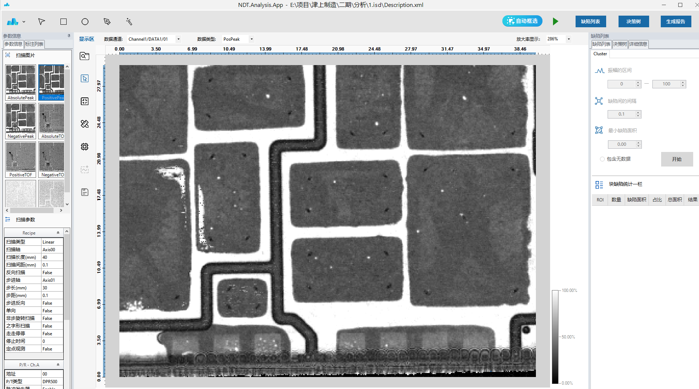
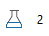

# 软件介绍

[软件介绍](#_Toc26747) 1

[1.启动分析软件 1](#_Toc17061)

[1.1启动分析软件 1](#_Toc16295)

[2.读取扫描 2](#_Toc23824)

[2.1菜单栏：ROI 3](#_Toc25277)

[3. 参数信息 4](#_Toc9835)

[4. 显示区 5](#_Toc20976)

[4.2颜色条 5](#_Toc19876)

[5.缺陷列表 6](#_Toc31220)

[5.1缺陷参数设置： 6](#_Toc2090)

[5.2执行结果 7](#_Toc4035)

[6.详细信息 7](#_Toc24378)

[6.1 详细信息 7](#_Toc1860)

[7. 决策树 8](#_Toc12362)

[7.1判定条件 8](#_Toc25721)

[7.2判定结果 9](#_Toc16920)

[8. 生成报告 11](#_Toc25318)

## 1.启动分析软件

###  1.1启动分析软件

打开软件，弹出许可证弹框。单击close，进入分析软件。

## 2.读取扫描

单击右上角图标的下拉按钮，点击读取扫描，选择需要分析的isd文件，点击确定

### 2.1菜单栏：ROI

  箭头：选中roi框

  方形：框选区域为正方形

  圆形：框选区域为圆形

  钢笔：自定义框选区域

  魔术棒：自动框选一个区域

  自动框选：自动框选样品上的区域

   添加：框选区域后，需要点击添加按钮，否则为未框选

   删除：选中框选区域后，点击删除按钮，可删除选中的区域

  全部删除：箭头选中状态下，点击全部删除，可删除所有框选区域（删除所有ROI）

   底色：点击底色按钮，所有框选的roi底色会不显示

## 3.参数信息

    

**扫描图片：读取成像图，单击一个图片，右侧显示显示图片**

**扫描参数：**

**Recipe:**** 扫描样品相关设置信息**

**P/R-Ch.A**** ： ****dpr**** 设置相关信息**

## 4.显示区

### 4.2颜色条

| 轮廓线 | 设置轮廓线的颜色 |
| --- | --- |
| 无数据 | 设置无数据显示的颜色 |
| 同步 | 有多个切片数时，勾选同步，可以一键修改所有切片的颜色 |
| 添加颜色 | 当前显示的颜色条添加其他颜色 |
| 添加阈值颜色 | 当前显示的颜色条添加阈值颜色 |
| 层次 | 颜色条渐变线性或渐变实心显示 |
| 对称模式 | 设置对称性或非对称性显示 |
| 系统选项版 | 设置默认、彩虹、层次、相位反转显示 |
| 用户选项版 | 可添加调色板和保存调色板 |
| 显示刻度 | 设置是否显示刻度 |

## 5.缺陷列表

### 5.1缺陷参数设置：

振幅区间：设置振幅区间

缺陷间隔：设置缺陷间的间隔，最小间隔0.1

最小缺陷面积：设置最小缺陷面积，最小缺陷面积0.01

是否包含无数据：是否包含无数据内容

开始按钮：点击开始，执行参数

### 5.2执行结果

缺陷统计：执行后显示所有ROI的缺陷数量、面积以及占比

图片：每个ROI上方显示各自缺陷占比以及缺陷数量

## 6.详细信息

### **6.1**  **详细信息**

显示区点击箭头图标，选中图片上的ROI框，详细信息里显示该ROI的位置以及缺陷列表

## 7.决策树

### 7.1判定条件

勾选的条件参与判定 ，若未勾选则不参与判定

总缺陷面积占比：判断每个ROI总缺陷面积占比大于阈值则为OK或NG

缺陷个数：判断每个ROI总缺陷个数大于阈值则为OK或NG

缺陷总面积：判断每个ROI总缺陷面积大于阈值则为OK或NG

最大单个缺陷面积：判断每个ROI最大缺陷面积大于阈值则为OK或NG

逻辑：ROI所有判定为OK，则ROI的结果为OK；若ROI所有判定条件有一个为NG，则ROI的结果为NG

开始判定按钮：设置完判定条件，点击开始判定

### 7.2判定结果

#### 7.2.1 判定统计

显示总ROI数量

显示ROI判定为OK的数量

显示ROI判定为NG的数量

#### 7.2.2 判定列表

显示每个ROI判定条件以及对应的结果

#### 7.2.3判定详情

显示选中ROI判定详情

#### 7.2.4图片显示

判定后，图片上ROI右下角显示判定结果

## 8.生成报告

1.选择生成报告内容：分析结果和分析整体概况

2.输入报告信息：样品名称、样品编号、检测机器、检测日期、检测单位、报告页面

3.点击生成报告

4.导出pdf文件

