**操作文档**

[操作文档](#_Toc28725) 1

[1. 硬件框架： 2](#_Toc5922)

[2.扫描软件的框架： 3](#_Toc6073)

[3.扫描步骤 4](#_Toc19085)

[3.1双击启动应用 4](#_Toc5689)

[3.2应用加载中，等待初始化弹框 4](#_Toc16620)

[3.3初始化（机械轴回原点） 5](#_Toc10529)

[3.4设定 5](#_Toc17222)

[3.5扫描配置 7](#_Toc6527)

[3.5.1打开频道A（默认为打开状态） 8](#_Toc4618)

[3.5.2打开水泵模式 8](#_Toc15159)

[3.5.3.将探头 (transducer) 移至待测区域样品的中心位置 9](#_Toc14841)

[3.5.4.设定中心 9](#_Toc30408)

[3.5.5.闸门设定 10](#_Toc23886)

[3.5.6设定焦距 11](#_Toc14930)

[3.5.7.调整增益 12](#_Toc31536)

[3.5.8扫描区域设置 12](#_Toc21442)

[3.5.9开始扫描 13](#_Toc20407)

[3.5.10成像区 13](#_Toc1349)

[3.5.10颜色条设置 14](#_Toc30981)

[3.5.11保存扫描内容 15](#_Toc28277)

# 1.扫描硬件框架：
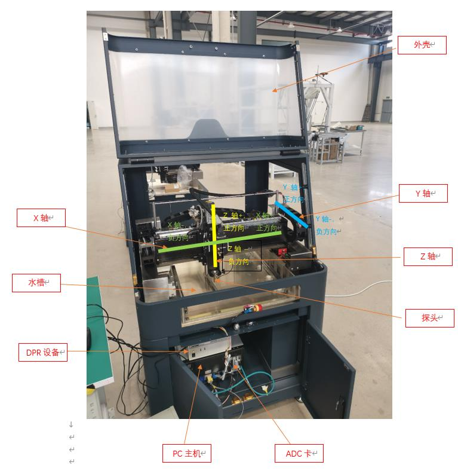

# 2.扫描软件框架：

\*\*\*软件使用前的注意事项: 确保所有的硬件、驱动以及配置全部完成，且检查并确认过。

_ACS __软件的__ Buffer__需要提前写入，一般情况下，已经完成了。_

_关于机器的一些特殊的配置参数，一般情况下，已设置完成了。_

_如需要配置 __Buffer__ 和软件的配置参数_

_请联系供应商，张婷，电话__: 13851694771_

## 3.扫描步骤

扫描软件的一般流程如下:

1. 打开软件
2. 配置DPR以及ADC的设置
3. 配置扫描样品的参数(分辨率，焦距，大小等)
4. 开始扫描
5. 查看成像结果
6. 保存扫描数据

**详细步骤如下：**

## 3.1双击启动应用

目录: 默认情况下，放在电脑的桌面上。

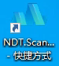

## 3.2应用加载中，等待初始化弹框

## 3.3初始化（机械轴回原点）

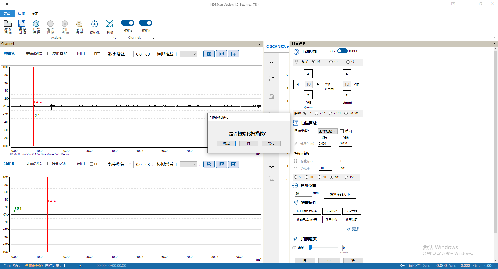

1. 单击YES，开始初始化，等待初始化完成

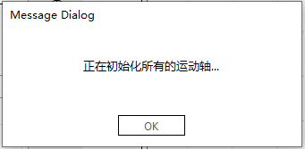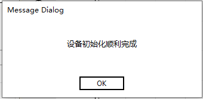

（2）单击NO，弹框消失，默认当前位置为原点

（3）单击Cancel，退出应用

## 3.4设定

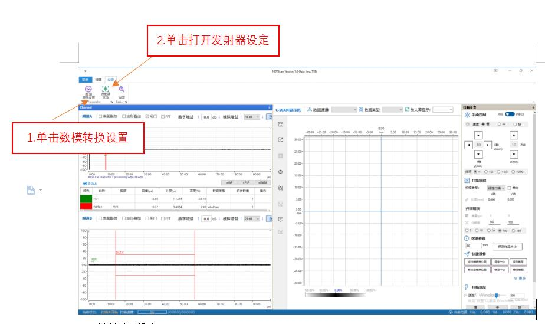

1. 数模转换设定

取样率：1000取样率越高，采样数据越多

可设置频道A/B的信号设定 耦合：AC 模拟信号 DC：数字信号

输入范围：选择输入电压范围

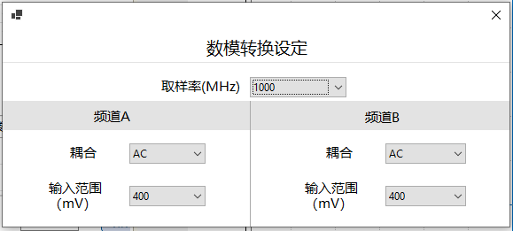

1. 发射器设定

1. 打开ch.A或ch.B
2. 调整低通滤波：50MHz 例如设置50Mhz，表示低于50Mhz以内的波形让它通过，高于50Mhz以上的波形过滤掉 （看实际的产品和反射波行）

高通滤波：2.5MHz例如设置10Mhz，表示高于10Mhz的波形让它通过，低于10Mhz的波形过滤掉

1. 模式：回声/穿透模式切换
2. 电压：330V 电压越高，超声波发射能量越大
3. 减幅：50 减幅越小，波形频率变大
4. 能量：low 设定电压总能量，能量越高，波形振幅更大

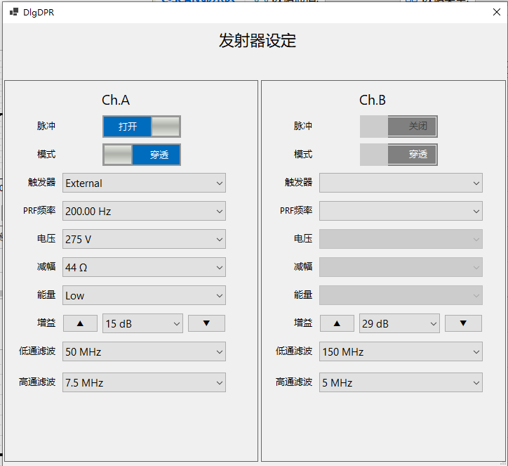

## 3.5扫描配置

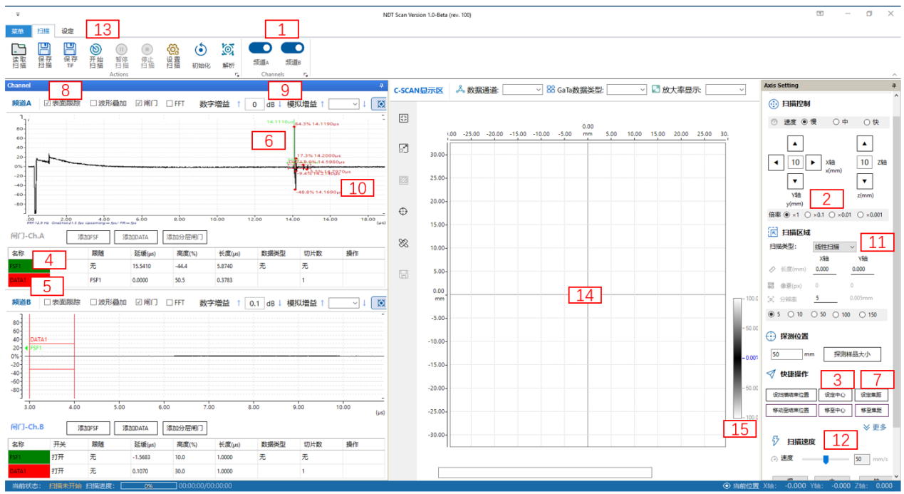

### 3.5.1打开频道A（默认为打开状态）

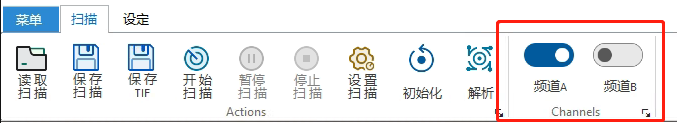

### 3.5.2打开水泵模式

（1）菜单栏-设定-设置-io设置-勾选自动喷洒模式

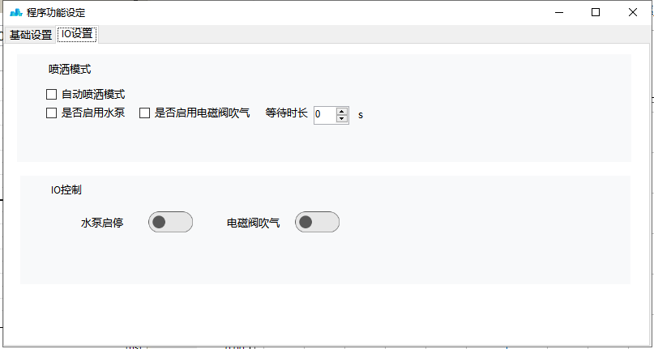

是否启用水泵：控制点击开始扫描后是否打开水泵

是否启用电磁阀吹气：控制点击开始扫描后是否打开电磁阀吹气

等待时长：控制点击开始扫描后

（2）Io控制：测试水泵和电磁阀开关

### 3.5.3.将探头 (transducer) 移至待测区域样品的中心位置

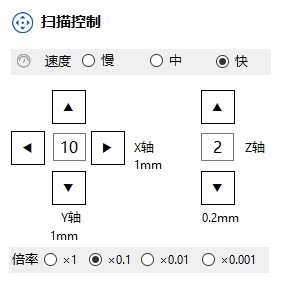

1. 选择您想移动轴的速度
2. 左右移动X轴，在X轴上，让探头移至样品的中心
3. 上下移动Y轴，在Y轴上，让探头移至样品的中心

说明: 中间框输入值，单击箭头，轴向对应方向移动对应的值

中间为空，长按箭头，轴以对应速度向对应方向移动

### 3.5.4.设定中心

样品已经移动至探头的中心后，点击设定中心按钮。

移至中心：设定中心后，若后面探头不在中心位置，可点击移至中心，探头会快速移至中心位置

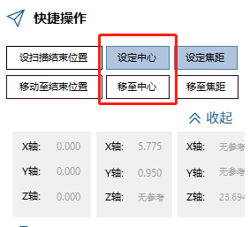

### 3.5.5.闸门设定

（1）在"闸门窗口"中,打开FFS1 (Front Surface Follower表面追踪线)", 激活绿线FFS1

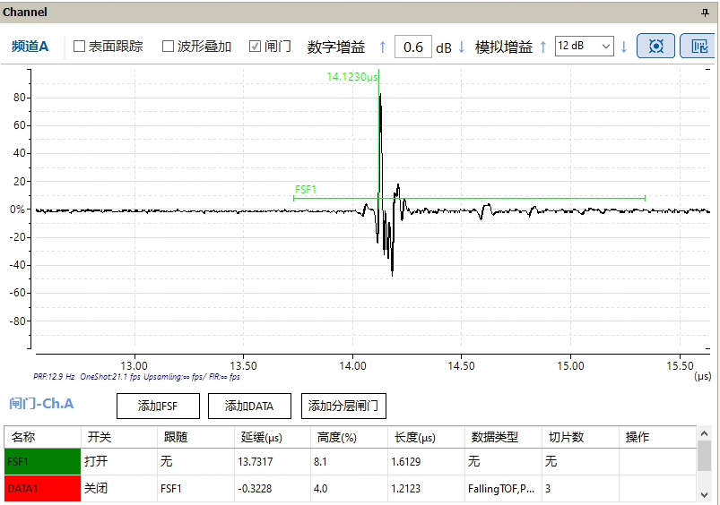

（2）在闸门窗口中, 打开DATA1, 激活"Data Gate 1";可勾选数据类型；跟随选择FSF1; 红框 (Data Gate 1)便会跟着绿线"FSF "一起移动。

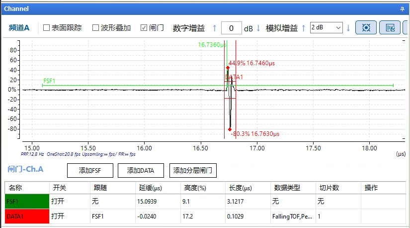

（3）选取第二组波, 即样品真正的信号，把第二组波放大。将绿线FSF1移至第二组波上, 即样品的表面上。

注意: 在扫描过程中，保证第一支波表面波一定要时刻被绿线切到

例：以硬币为例，将Data Gate 1 (红框)框住表面波， 如下图所示

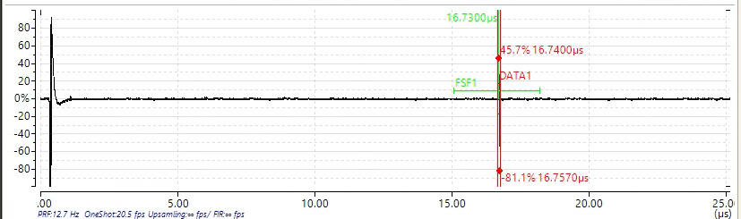

### 3.5.6设定焦距

（1）微调焦点: 在扫描设置窗口, 点击Z轴上下箭头, 将探头移上或下, 注意右上数字Amp, 直至波峰(Amp数字)为最大，说明找到了最佳焦距。

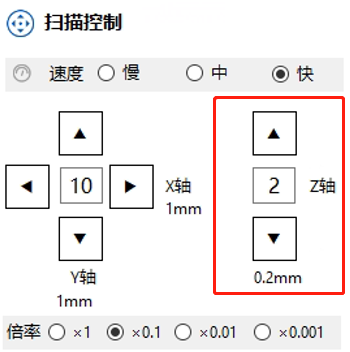

（2）找到焦距后，点击设定焦距按钮

移至焦距：设定焦距后，若后面探头不在焦距位置，可点击移至焦距，探头会快速移至焦距位置

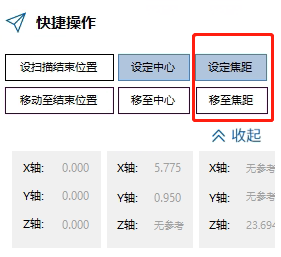

（3）微调焦点时, 若波形跑掉, 勾选波形上方上的"表面跟踪", 波形便会跟着FSF跑

### 3.5.7.调整增益

（1）点击频道A窗口中的模拟增益，改变增益值，使波形的最高反射率(Amp)在60~80%左右

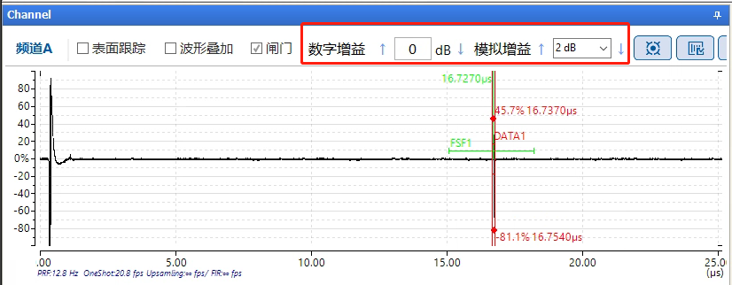

（2）调节DATA 1的上下高度，使扫描中屏幕中的一组信号都能超过红框的高度，不能让其他噪声波超过红框

### 3.5.8扫描区域设置

（1）在扫描设置窗口中: 在扫描区域里, 选择扫描类型为线性扫描，设定扫瞄范围大小; 设定分辨率, 分辨率越小, 像素越高

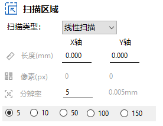

（2） 在扫描设置窗口中， 可选快/中/慢修改速度和加速度。也可以手动输入

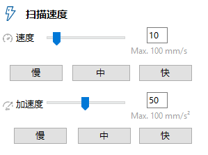

### 3.5.9开始扫描

单击开始扫描按钮, 开始扫描。扫瞄时, 点击暂停扫描按钮, 则暂停;再点击继续扫描, 则继续。扫瞄时,点击停止扫描 , 则中止扫瞄

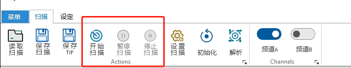

### 3.5.10成像区

单击开始扫描后，C-Scan实时显示成像

扫描过程中：

（1）可以改变增益值，频道A窗口中的模拟增益和数字增益，若改变后，可以看到C-scan图像颜色有明显分界线（增益值越大，反射越大，成像越白。增益值越小，成像颜色深）

（2）扫描过程中，也可更改扫描速度和加速度

### 3.5.10颜色条设置

扫描过程中和扫描完成后，可修改图像颜色

（1）双击图像旁边的颜色条

（2）可以修改无数据的颜色：单击NoData，更改颜色

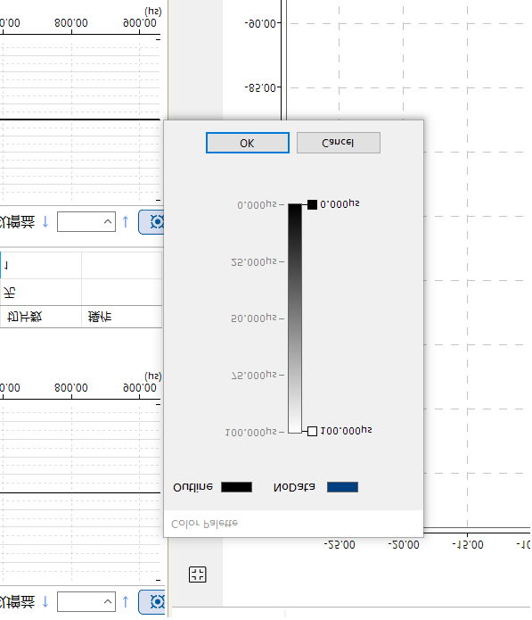

(3)可以修改颜色条：右击选择System Palettes-\>Rainbow

选择颜色后，上下拖动对应的颜色方形框，修改颜色条深浅度

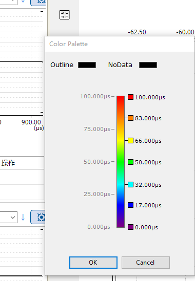

1. 单击OK，成像显示修改后的颜色，旁边的颜色条也显示修改后的颜色条

恢复默认颜色条：双击图像旁边的颜色条，右击选择System Palettes-\>Default,单击保存，颜色条恢复默认

### 3.5.11保存扫描内容

扫描完成后，自动保存在配置文件里设置的目录下或者手动保存

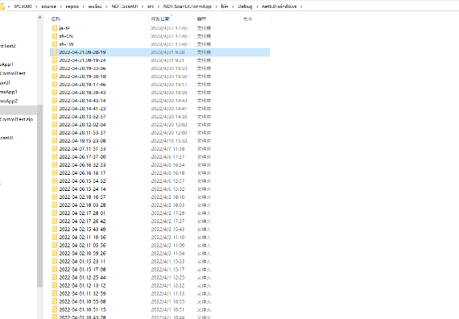