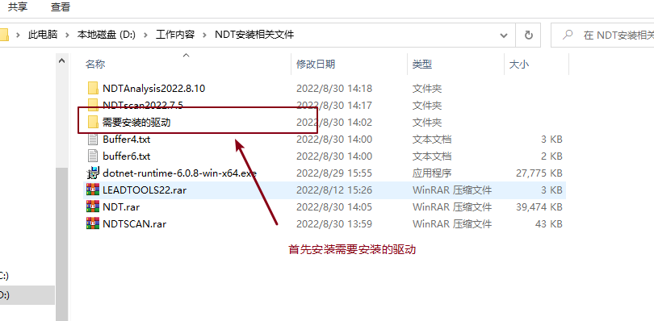
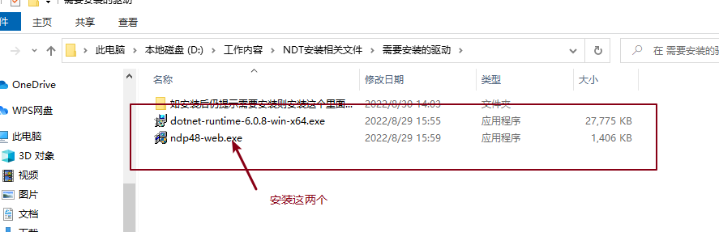
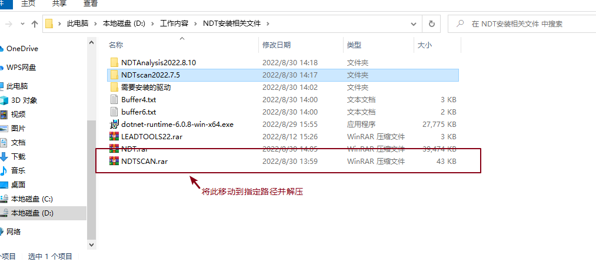
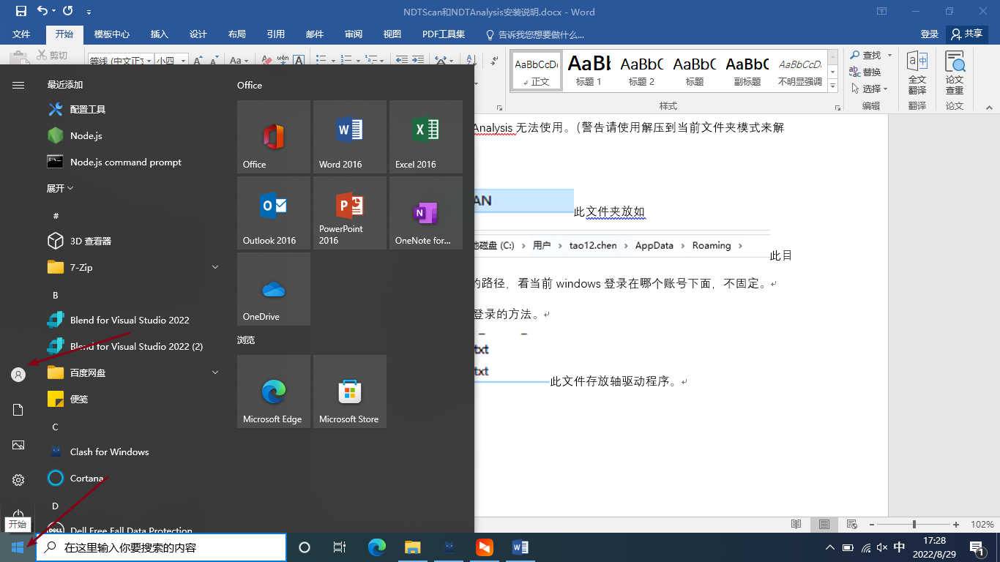
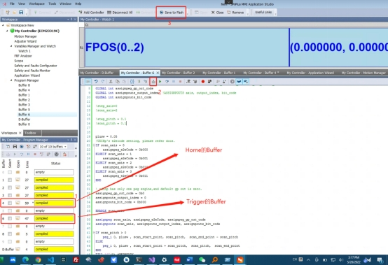
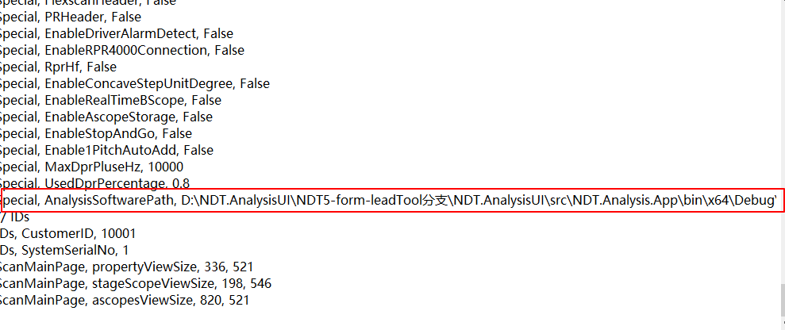
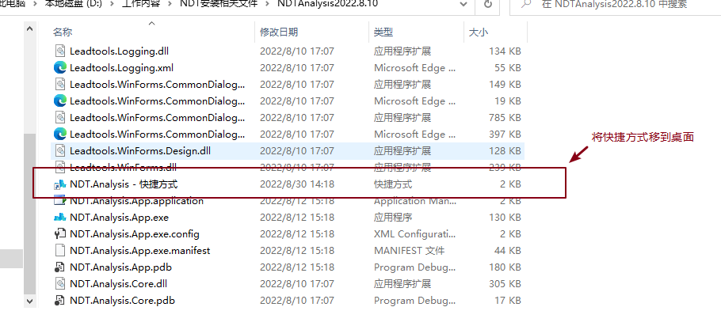
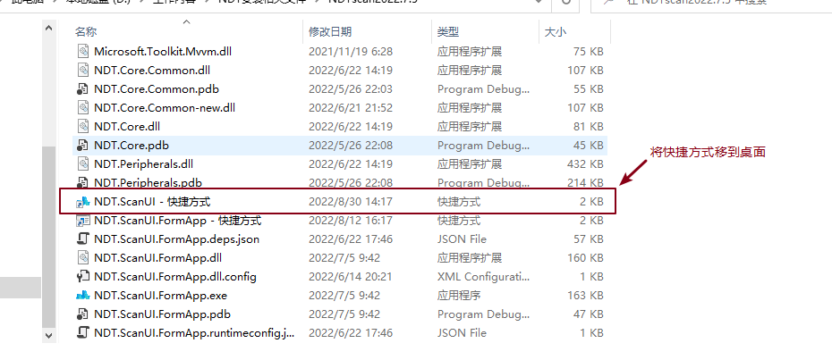

NDTScan和NDTAnalysis安装说明

1、先使用U盘对，其中驱动文件解压并进行安装，如跳过这步，可能将会在NDTScan运行中蓝屏重启。

2、安装需要安装的驱动

如在打开软件时遇到问题，则打开

中进行安装。

3、 将文件放入C盘的下解压并删除.rar文件，如跳过会导致NDTAnalysis无法使用。（警告请使用解压到当前文件夹模式来解压）

4、将此文件夹放如
此目录下，用户后面的路径，看当前windows登录在哪个账号下面，不固定。

看当前windows登录的方法。

5、 此文件存放轴驱动程序。

如下操作：

1. buffer4和6添加home、trigger的buffer
2. 单击编译
3. 单击save to flash
4. 勾选buffer4和6，点击save

6、把打包好的NDTScan和NDTAnalysis的压缩包置于除C盘外的根目录下解压并删除压缩包。

插上密钥，尝试打开里面的NDTAnalysis.exe程序，诺完成上面步骤，将大概率不会出现问题。

7、复制NDTAnalysis的.exe程序，复制其完整路径，打开 （c盘下的用户的appdata下的\Roaming）下的sysyem.ini文件。（使用记事本打开）

找到如下内容，把路径复制在AnalysisSoftwarePath,（逗号）后面，不要有空格。打开NDTScan测试是否有跳转。如无效果则重试上一步。

到这，NDTAnalysis已经配置完成。

8、

一般安装已经结束。

下面对于轴的运动控制的相关参数进行叙述。

轴的运动方向与实际软件方向不符，通过更改NDTSCAN下的scanner\_acs中的AxisDisc来进行修改，正常情况下给定的配置文件使没有问题的，此时出现此问题可以询问相关厂家，是否是安装错误。

AxisNo,0,1,2,3

轴序号

Enable,True,True,False,True

配置对应的轴是否启用

SpeedLow,20,20,20,5

低速的设置，更改此项可以改变软件中低速的值。

SpeedMid,50,50,50,10

中速的设置，更改此项可以改变软件中中速的值。

SpeedHigh,100,100,100,20

高速的设置，更改此项可以改变软件中高速的值。

SpeedMax,1500,10,1200,100

速度的最大值。

InitOrder,2,3,0,1

初始化时轴的初始化顺序

重要内容：其中3时探头的上下移动，0是左右的运动是扫描轴，1是步进轴，前后移动。

PresetSpeed,Mid,Mid,Mid,Mid

预设的速度。

Length,400,400,100,60

整个绘制区域的大小，400的长，400的宽，60的Z轴。

AxisDisc,SCAN,STEP,NONE,FOCUS

用于设置软件控制时，映射实物机器运动的位移，如改动会造成软件移动和实际移动不符。

初始文件不建议修改，目前已经是最佳配置。

文中没提到的不建议修改。