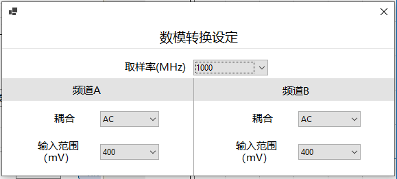

# 软件介绍

[软件介绍](#_Toc12722) 1

[1.启动软件弹框 2](#_Toc19166)

[1.1启动扫描软件，硬件异常弹框 2](#_Toc20205)

[1.2初始化（机械轴回原点） 2](#_Toc31930)

[2.菜单栏：扫描 3](#_Toc2903)

[2.1读取扫描 3](#_Toc1440)

[2.2保存扫描 4](#_Toc6616)

[2.3开始扫描 4](#_Toc13220)

[2.4暂停扫描 4](#_Toc981)

[2.5停止扫描 4](#_Toc6067)

[2.6扫描设置 4](#_Toc30521)

[2.7初始化 5](#_Toc19954)

[2.8解析 5](#_Toc21978)

[2.9频道 6](#_Toc5661)

[3. 菜单栏：设定 6](#_Toc6351)

[3.1数据转换设置 6](#_Toc9208)

[3.2发射器设定 6](#_Toc28598)

[3.3设定 7](#_Toc4096)

[3.4设置 8](#_Toc769)

[4. 波形图： 9](#_Toc21258)

[4.1表面跟踪 9](#_Toc14781)

[4.2波形叠加 9](#_Toc19311)

[4.3峰值隐藏 9](#_Toc9834)

[4.4闸门 9](#_Toc240)

[5. 显示区 10](#_Toc7148)

[5.1左侧功能注释 10](#_Toc17536)

[5.2颜色条 11](#_Toc12949)

[6.扫描设置 11](#_Toc29588)

[6.1手动控制：控制X、Y、Z轴的移动 12](#_Toc1744)

[6.2扫描区域 12](#_Toc8867)

[6.3探测位置 13](#_Toc1541)

[6.4快捷操作 13](#_Toc20734)

[6.5扫描速度 13](#_Toc932)

[7.扫描状态和当前位置 13](#_Toc6194)

[7.1扫描状态 13](#_Toc24441)

[7.2当前位置 13](#_Toc7042)

## 1.启动软件弹框

### 1.1启动扫描软件，硬件异常弹框

打开软件，相关硬件设备异常会弹框显示。单击确定软件退出，确保硬件打开后再打开软

### 1.2初始化（机械轴回原点）

1. 单击YES，开始初始化，等待初始化完成

（2）单击NO，弹框消失，默认当前位置为原点

（3）单击Cancel，退出应用

## 2.菜单栏：扫描

### 2.1读取扫描

操作步骤：单击读取扫描-选择isd文件-点击确定

可以读取之前保存的扫描（isd）文件，包含：成像、扫描设置等信息

### 2.2保存扫描

保存本次的扫描设定和结果(.isd)文件

操作步骤：扫描结束后-单击保存扫描-输入文件名名-点击确定

### 2.3开始扫描

**参数设定后可以开始扫描：**

1.扫描参数设定：

（1）设定中心（X\Y轴）：探头移动至样品中心

（2）设定焦距（Z轴）：探头移动至最佳焦距

（3）设定样品大小

（4）设定分辨率

（5）设定表面跟踪线FSF和闸门DATA

2.参数设定后，可以点击开始扫描按钮，开始扫描

### 2.4暂停扫描

扫瞄时, 点击暂停扫描按钮, 则暂停;再点击继续扫描, 则继续。

### 2.5停止扫描

扫瞄时,点击停止扫描 , 则中止扫瞄

### 2.6扫描设置

设置扫描计划相关信息：

当扫描设置页不显示时，点击扫描设置，界面右侧显示扫描设置内容

### 2.7初始化

**初始化所有的轴到默认位置：**

点击初始化，机械轴初始化运动回到原点，等待初始化完成

### 2.8解析

点击解析，跳转至解析界面

（配置文件里解析的路径需要添加）

### 2.9人工解析

功能说明：判定的功能是为了扫描样品结束后，能够快速的对样品的好坏进行判定。目前判定支持人工判定和第三方AI判定。

**2.9.1**** 扫描界面：**

1.序列号录入：动态格式可在配置文件System.ini里进行配置：

Special, SerialFormatTemplate, {$Model}\_{$Serial}

Model:电池型号 Serial：序列号

1.正面和反面选择：扫描前选择Top或Btm ，文件传输后可知晓扫描的是正面或反面

**2.9.2**** 判定界面：**

1.支持通道和数据类型选择:判定界面支持单探头和双探头通道，可切换对应的闸门和数据类型

2.显示对应序列号：扫描界面的备注框里按顺序输入样品序列号，传输至判定界面后序列号与扫描样品对应

3.支持读取文件：若自动传输文件选择取消，后面可通过读取文件重新判定

4.支持UNC、OK、NG三种判定

5.统计当前判定总数，统计各判定结果的数量

6.检测模式：手动和自动

7.配置路径支持动态参数，详细参数请参照下文的参数列表

配置的文件路径为:

C:\Users\Administrator\AppData\Roming\NDTSCAN

**（**** 1 ****）手动：人工判定**

在判定界面进行人工判定，判定后点击保存结果

判定后可保存判定后的图片和csv文件，存储路径可在配置文件system.ini进行配置：

Csv **动态路径：**

**PersonAnalysis,PersonAnalysisResultCsvSavePath,**

D:\\CSV\\{$ShortYear}{$Month}{$Day}\\{$MachineNumber}\\{$HHMMSS}\_{$MachineNumber}\_\_AI\_judge\_result.csv

**Image**** 动态路径 ****:**

**PersonAnalysis, PersonAnalysisResultImageSavePath,**

D:\\Img\\{$ShortYear}{$Month}{$Day}\\{$MachineNumber}\\{$Surface}\\{$Result}\\{$HHMMSS}\_{$MachineNumber}\_{$Layer}\_{$Surface}\_{$Model}\_{$Serial}.bmp

**（**** 2 ****）自动：第三方**** AI ****判定**

扫描完成后，将分割后的图片传输到指定文件夹.

分割图片存储路径和图片名称可在配置文件system.ini进行配置：

**PersonAnalysis, AIAnalysisOrignalImageSavePath,**

D:\\SAVE\_IMAGE\\{$ShortYear}{$Month}{$Day}\\{$MachineNumber}\\{$HHMMSS}\_{$MachineNumber}\_{$Layer}\_{$Surface}\_{$Model}\_{$Serial}.bmp

AI判定后的结果图片保存路径可在配置文件system.ini进行配置，读取后可在判定界面显示

PersonAnalysis, AIAnalysisResultImageSavedPath ,

D:\\AI\_RESULT\\UI\_INTERFACE\\{$HHMMSS}\_{$Result}\_{$Confidence}\_{$MachineNumber}\_{$Layer}\_{$Surface}\_{$Model}\_{$Serial}.bmp

8读取文件后需要显示扫描时是正扫还是反扫

9可添加检测人员姓名，用于记录判定人员信息

10可重复使用序列号进行扫描

11.目前每行样品可显示3个，若有多个可切换下一页/上一页

## 动态参数列表：

**动态路径变量：**

变量的格式必须是{$VariableName}

具体的变量如下:

Year：年 如：2022

ShortYear：短年 如：22

Month：月 如：11

Day：日 如：dd

MachineNumber：机器编号：01

HHMMSS：时分秒

Layer：(1-channel)(1-gate)(2-slice)(1-type)：通道闸门切片类型

如：12031 1=ChA 2=DATA2 03=切片3 0=数据类型为AbsPeak 1=数据类型为AbsTof 2=数据类型为FallingEdge 3=数据类型为RasingEdge

Surface：Top或Btm 等

Model: 样品型号

Serial：序列号

Bmp：图片格式 例如：bpm、jpg、png

Result：结果 如：OK、NG、UNC

Confidence：结果可信度 如：80

### 2.10频道

切换Channel显示波形：可以打开频道A或频道B，或者两者都打开

## 3.菜单栏：设定

### 3.1数据转换设置

**采集卡的设定**** ：**

可设置取样率：1000取样率越高，采样数据越多

可设置频道A/B的信号设定 耦合：AC 模拟信号 DC：数字信号

输入范围：选择输入电压范围 例如设定400毫伏，总振幅电压范围为400\*2=800毫伏

### 3.2发射器设定

**超声波发射器信息设定：**

1. 打开ch.A或ch.B
2. 模式：回声/穿透模式切换
3. 触发器：选择内部触发或外部触发，默认选择外部触发
4. PRF频率：内部触发时，发射超声的频率设定
5. 电压：330V 电压越高，超声波发射能量越大
6. 减幅：50 调节信号大小（振幅变小，频率变高的现象），
7. 能量：low 设定电压总能量，能量越高，波形振幅更大
8. 增益：可调节整体波形振幅的大小
9. 调整低通滤波：50MHz 例如设置50Mhz，表示低于50Mhz以内的波形让它通过，高于50Mhz以上的波形过滤掉 （看实际的产品和反射波行）

（10）高通滤波：2.5MHz例如设置2.5Mhz，表示高于2.5Mhz的波形让它通过，低于2.5Mhz的波形过滤掉

### 3.3设定

Mm刻度按钮：设定波形图是以时间还是刻度为单位，可进行切换

设置水传播速度和材料传播速度

### 3.4设置

#### 3.4.1基础设置

设置是否启动自动传输:扫描结束后，自动保存文件并将数据传送至自动解析软件解析软件

分析软件地址：自动解析软件路径地址

自动保存路径：条件：自动保存按钮打开。扫描结束后，文件自动保存地址。

自动保存扫描：是否打开自动保存按钮，若打开，自动保存地址已填，扫描结束后会将文件自动保存至设置的路径。若不打开，扫描结束后不会自动保存文件

人工分析跳转：打开按钮，扫描结束后，自动保存文件并将数据传送人工解析界面进行判定。关闭按钮，则不会跳转至人工解析界面，可手动点击人工解析按钮进入。

传输弹框：

**人工判定弹框（手动）：**

点击是：数据自动传输至人工判定界面

点击否：弹出自动保存的路径后，关闭弹框

**人工判定弹框（自动）：**

点击是：数据自动传输至人工判定界面，关闭弹框，并且将分割后的图片保存到配置的文件夹下

点击否：关闭弹框，数据不会传输至人工判定界面。

#### 3.4.2 IO设置

1.勾选自动喷洒模式：

是否启用水泵：控制点击开始扫描后是否打开水泵

是否启用电磁阀吹气：控制点击开始扫描后是否打开电磁阀吹气

等待时长：控制点击开始扫描后

2.IO控制：测试水泵和电磁阀开关

## **4.波形图：**

### 4.1表面跟踪

勾选表面跟踪，在移动探头（上下）时（波形左右会移动）

Data等区域会以Fsf为基准，跟随波形移动.一般用于调整焦距

### 4.2波形叠加

勾选波形叠加：Ascan的波形扫描前重复叠加

### **4.3**** 峰值隐藏**

峰值隐藏：所有DATA的峰值不显示

峰值显示：所有DATA的峰值显示

峰值选中：显示选中DATA的峰值

### 4.4闸门

**勾选闸门，波形图下方显示闸门，不勾选，波形图下方不显示闸门**

| FSF | 表面跟踪先，样品置于不平的情况下，探头接收表面返回的超声波所需的时间不同，FSF表面跟踪功能可以在接收到表面返回声波后通过固定的时间间隔来获取同意层面的图片 |
| --- | --- |
| DATA | 采集产品表面或者里面的数据 |
| 添加FSF | 可以添加多个FSF，名称可以修改但不能重复 |
| 添加DATA | 可以添加多个DATA，名称可以修改但不能重复 |
| 开关 | 是否启用FSF和DATA |
| 跟随 | DATA选择跟随FSF，跟随后DATA跟随FSF显示 |
| 延缓 | 调整FSF或DATA，延缓跟随变换 |
| 高度 | 调整FSF或DATA，高度跟随变换 |
| 长度 | 调整FSF或DATA，长度跟随变换 |
| 切片数 | DATA分成对应的份数 |
| 数据类型 | 计算勾选的数据类型，可以勾选TOF、peak、falling、rising |
| 中心位置 | 将FSF和DATA展现在波形中间 |
| 数字增益 | 改变软件里波形的增益值，相当于放大缩小波形 |
| 模拟增益 | 改变硬里件波形的增益值，相当于放大缩小波形 |
| 保存图片 | 保存波形图 |
| 保存数据 | 保存波形数据 |

## 5.显示区

### 5.1左侧功能注释

| 数据通道 | 切换数据通道 |
| --- | --- |
| GaTa数据类型 | 切换TOF、peak、falling、rising，会切换不同成像 |
| 放大率显示 | 修改成像分辨率 |
| 还原大小 | 成像变成原始大小 |
| 扫描区间 | 扫完之后，针对某一小的区域进行扫描，图像上匡出长方形区域，可以重新扫描 |
| 探头移动 | 在图像上按下某个键，探头会直接移动到这个点位上 |
| 测量 | 成像区测量长和宽的长度 |
| 图形保存 | 保存成像图，可以保存当前成像图或保存所有成像图 |
| 图像数据保存 | 保存成像数据为tiff格式 |
| 备注 | 填写序列号或其他信息 |
| 颜色百分比 | 调整成像颜色 |
| 人工判定 | 对扫描成像进行人工判定 |
| 模式切换 | 图片切换模式，不以像素显示 |

### 5.2颜色条

| 轮廓线 | 设置轮廓线的颜色 |
| --- | --- |
| 无数据 | 设置无数据显示的颜色 |
| 同步 | 有多个切片数时，勾选同步，可以一键修改所有切片的颜色 |
| 添加颜色 | 当前显示的颜色条添加其他颜色 |
| 添加阈值颜色 | 当前显示的颜色条添加阈值颜色 |
| 层次 | 颜色条渐变线性或渐变实心显示 |
| 对称模式 | 设置对称性或非对称性显示 |
| 系统选项版 | 设置默认、彩虹、层次、相位反转显示 |
| 用户选项版 | 可添加调色板和保存调色板 |
| 显示刻度 | 设置是否显示刻度 |

## 6.扫描设置

  

### 6.1手动控制 **：控制**** X ****、**** Y ****、**** Z ****轴的移动**

1. 选择您想移动轴的速度
2. 左右移动X轴，在X轴上，让探头移至样品的中心
3. 上下移动Y轴，在Y轴上，让探头移至样品的中心

说明:index模式： 中间框输入值，单击箭头，轴向对应方向移动对应的值

jog模式：中间为空，长按箭头，轴以对应速度向对应方向移动

### 6.2扫描区域

#### 6.2.1线性扫描

扫描类型：可选择扫描类型为线性扫描

单向：可设置扫描时是单向扫描还是双向扫描

产品大小：可设置扫描产品的大小

扫描分辨率：可设置扫描分辨率，分辨率越小, 像素越高

#### 6.2.2托盘扫描

扫描类型：可选择扫描类型为托盘扫描

单向：可设置扫描时是单向扫描还是双向扫描

产品大小：可设置扫描产品的大小

跳跃：可设置X、Y方向的产品之间的间隔

数量：可设置X、Y方向的产品数量

扫描模式：可设置单个扫描模式(暂时只能行扫)

扫描分辨率：可设置扫描分辨率，分辨率越小, 像素越高

### 6.3探测位置

将探头移至样品上，设置探测位置，点击弹窗样品大小，会自动识别到样品大小和中心位置

### 6.4快捷操作

设扫描结束位置：设定扫描结束后，探头移动到的停留位置

移扫描结束位置：设定结束位置后，点击移扫描结束位置，探头会快速移至设扫描结束位置

设定中心：样品已经移动至探头的中心后，点击设定中心按钮。

移至中心：设定中心后，若后面探头不在中心位置，可点击移至中心，探头会快速移至中心位置

设定焦距：找到最佳焦距后，点击设定焦距

移至焦距：设定焦距后，如z轴移动到其他位置，可点击移至焦距，探头会快速移至焦距位置

### 6.5扫描速度

速度：设置扫描时的速度

加速度：设置扫描时的加速度

## 7.扫描状态和当前位置

### 7.1扫描状态

当前状态：扫描未开始、扫描中、扫描结束

扫描进度：实时显示扫描进度

### 7.2当前位置

当前位置：实时显示当前探头所在位置
